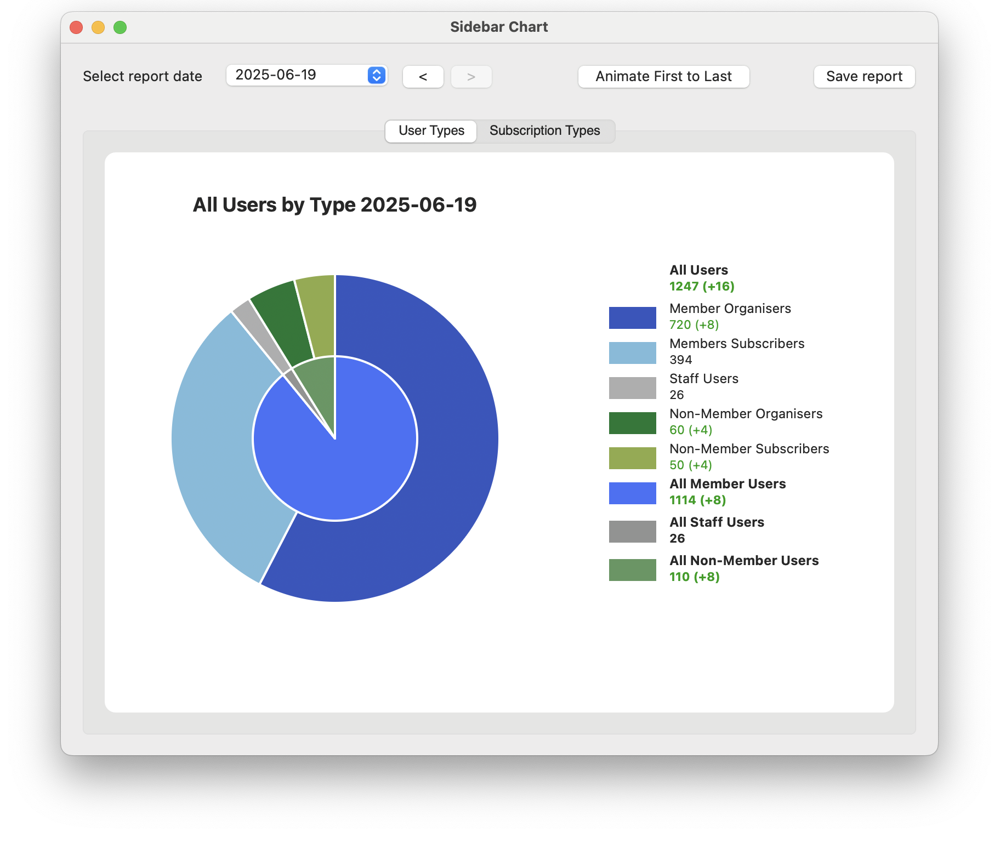
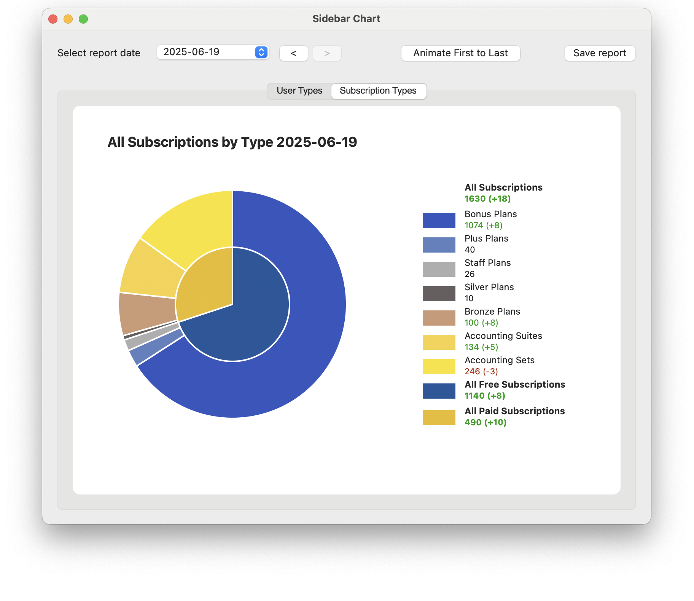

# SidebarChart
A sample app for charts with categories and custom sidebar legends.

## OVERVIEW

This sample app was developed with Xojo 2024-2025 on MacOS for **Xojo Year of Code July 2025**. 

## HIGHLIGHTS

- Circular charts with categories
- Custom chart legends as a dynamic sidebar
- Animations of charts from first date to last date
- Analysis of numbers from one date to the next
- Drilldown data for each chart and sidebar measure
- Adjustable listbox column widths
- Report generation of charts as PDF

This Xojo desktop application is a sample based on a recently developed app with thousands of users and many different charts.

For this simplified sample, I’ve included a database with a set of test users with date extracts for 18 months.

## PURPOSE
This app provides data statistics and reports on all users and subscriptions for a member organisation of accountants. 

- Members get free **bonus and plus subscription plans** 
- Non-members pay for **bronze and silver subscription plans**
- Both types of users can pay for **accounting sets** and **suites**
- Staff get free **staff subscriptions**

Both Members and Non-members are divided into **Organisers** and **Subscribers**.

Each data extract is imported into the app database copied in the Xojo CopyFiles step in the build process, regenerating the working database stored in Application Support. This allows us to process data for new features and improvements in **App.updateDatabaseAndSchema**

## USAGE
- Use the **Select report date** dropdown menu to select a date, or use the  **First to last** animation button to see the changes in users and subscriptions over time.

- The **Save report** button generates a report with both charts and sidebar legends for the selected date.

## DESCRIPTION
### Database
- The raw data is extracted from the organisation website and includes one table per date with one subscription per row. The data into SQLite as csv files Import table from csv file. For this sample app we just showing two sample charts. Not all available data is used in these sample charts. Also we are not focussed on data transformation from the raw output.

### Sidebar
- The sidebar legend uses colour coding and buttons to show the chart values, and differences, and to allow access to the drilldown data records.
- The StatisticsContainer is used to display each measure, with bold text for categories, as well as the difference between the previous dates value (green for improving values and red for worsening values).

### Categories
- Categories are shown as the central rings of the circular charts. They show the total for each category group as percentages in the chart, and as values in the sidebar legend.

### SQL
- SQL is provided via global methods returning strings that can be concatenated. This makes the code clearer and easier to read.

### Note
- This sample app is over engineered for this data due to major limitations in the raw format. This modular code allowed us to add new charts quickly and easily, for current and historical data.

## STATISTICS
Here are the sample statistics for 2024-01-18

Michelle Parker
Web Objectives
